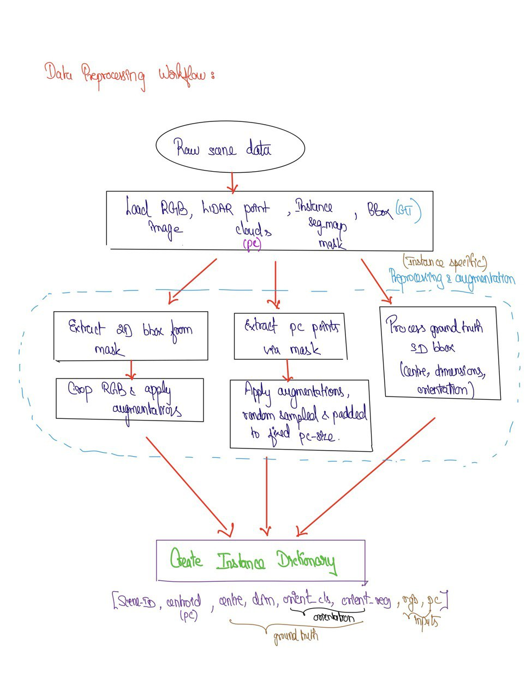
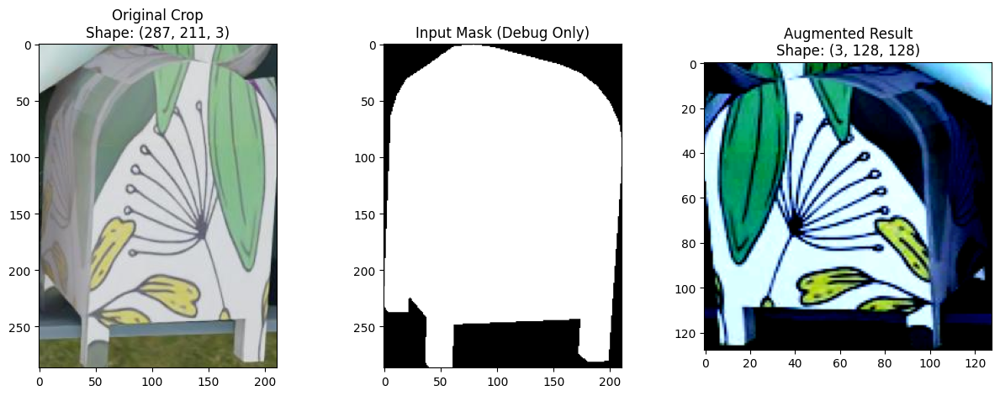
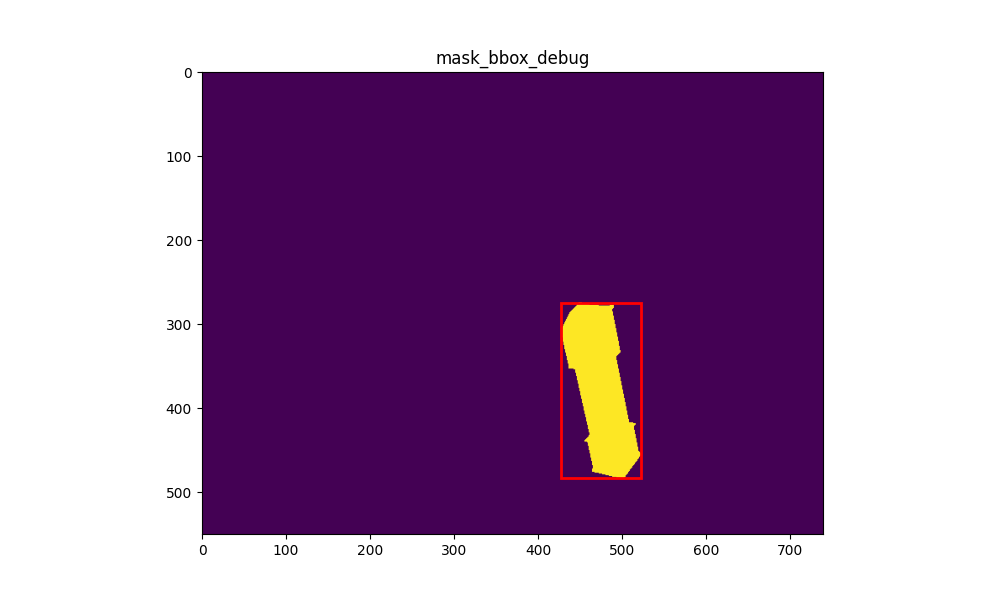
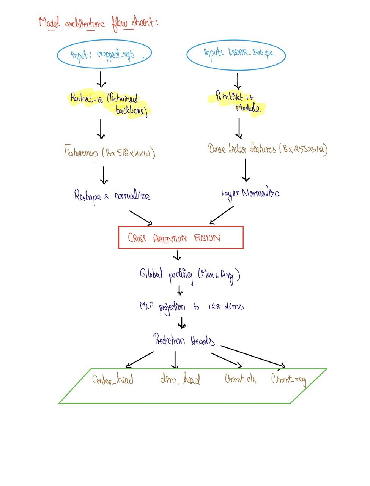

# Multimodal 3‑D Bounding‑Box Prediction

A lightweight PyTorch pipeline that **fuses RGB crops and LiDAR sub‑clouds** to regress metric‑accurate 3‑D bounding boxes *(centre, size, yaw)*. Designed as a clear, commented prototype—easy to read, hack, and port to edge devices.

## Problem Statement

The goal is to design a < 100 M‑param deep‑learning model that regresses an axis‑aligned 3‑D bounding box (centre, dimensions, yaw) for every object instance in a scene, using:

1. RGB image crops (2‑D)

2. LiDAR sub‑point‑clouds (3‑D)

3. Instance segmentation masks

4. Ground‑truth 3‑D boxes

Deliverables include an end‑to‑end pipeline — data loading, augmentation, model, training loop, evaluation, and inference script —  in PyTorch.

---

## At a Glance
|   |   |
|---|---|
| **Backbones** | ResNet‑18 *(pre‑trained, partly frozen)* + simplified PointNet++ |
| **Fusion** | 4‑head cross‑attention (LiDAR queries ⇄ RGB keys/values) |
| **Heads** | MLP ×4 → *centre (3), size (3), yaw‑cls (2 bins), yaw‑reg (2 bins)* |
| **Params** | ≈ 18 M (all heads + fusion) |
| **Training** | AdamW · ReduceLROnPlateau · early stopping |
| **Metrics** | 3‑D IoU · MAE/MSE (centre & dims) · mean yaw error |

---

## Repo Layout
```
3D-bbox-prediction/
├── code/                        # main.py + helper modules
│   ├── dataset / model / train  # (single‑file prototype for now)
│   └── sample_dataset.zip       # tiny demo set for smoke‑tests
├── docs/diagrams/               # hand‑drawn flow‑charts
├── sample_model_output_logs/    # TensorBoard & PNG examples
├── requirements.txt.txt         # Python deps
├── *.pdf                        # challenge brief & full methodology
└── README.md                    # you are here 🚀
```
---

## Quick Start
### 1 — Install
```bash
# clone
git clone https://github.com/Venkyyy88/3D-bbox-prediction.git
cd 3D-bbox-prediction

# env (conda or venv)
conda create -n bbox python=3.9 -y
conda activate bbox

# base requirements
pip install -r requirements.txt.txt

# (optional) torch‑geometric + CUDA wheels
pip install torch-scatter torch-cluster torch-spline-conv torch-geometric -f \
    https://data.pyg.org/whl/torch-$(python - <<<'import torch,sys;print(torch.__version__.split("+")[0])')+cu117.html
```

### 2 — Prepare Data

The complete full dataset is available in the following link: https://drive.google.com/file/d/11s-GLb6LZ0SCAVW6aikqImuuQEEbT_Fb/view?usp=sharing

The repo ships with **`sample_dataset.zip`** (≈ 2 MB) for a smoke‑test run. Unzip automatically via:
```bash
python code/main.py --stage preprocess --root dataset --out data/processed
```
> For your own data, organise each scene as:
> ```
> scene_001/
>   rgb.jpg          # full‑frame RGB
>   pc.npy           # (H,W,3) LiDAR points aligned to RGB
>   mask.npy         # (H,W) instance mask
>   bbox3d.npy       # optional (8,3) GT corners
> ```

### 3 — Train
```bash
python code/main.py --stage train \
    --data data/processed \
    --epochs 50 --batch 8 --lr 1e-4 \
    --save checkpoints/
```
* Early‑stopping (patience = 4) + LR‑scheduler kick in automatically.  
* Logs & media are written to **`logs/`** and **TensorBoard**.

### 4 — Evaluate / Inference
```bash
# validation metrics
python code/main.py --stage eval --ckpt checkpoints/best.pth --split val

# single‑scene inference (saves PNG & HTML point‑cloud)
python code/main.py --stage infer --scene path/to/scene_042
```

---

## On-the-Fly Data Preprocessing Pipeline
<details>
<summary>Click to expand</summary>



</details>

1. **Load** RGB, mask, LiDAR and optional GT box.  
2. **Crop** RGB by 2‑D mask → Albumentations augment (flip, colour‑jitter).  
3. **Extract** LiDAR points under the mask → Kornia 3‑D augment (rot / scale).  
4. **Sample / pad** to **`Config.LIDAR_POINTS = 1024`**.  
5. **Process GT** raw 3D bounding box (8,3) into target parameters - center, dimensions, orientation class and residual.
6. **Pack** into an *Instance Dictionary* → Load it via PyTorch collate function.

#### Visual Snapshot 
<p align="center">
  
  
</p>
<sub>The images above are logged automatically when `DEBUG_MODE=True`; file names may differ — swap paths if needed.</sub>
<sub> 
  Point Clouds: <a href="sample_model_output_logs/DataProcessingVisualization/masked_pc.html" target="_blank">Interactive masked point cloud (HTML)</a>
</sub>
---

## Network Details

<details>
<summary>Click to expand</summary>



</details>

### 🔍 Backbones
* **ResNet‑18**: first three stages frozen for stability; final block fine‑tunes.  
* **Simple PointNet++**: two set‑abstraction layers (`fps` + `radius`) → 512‑D per‑point features.

### 🔀 Cross‑Attention
```
LiDAR (queries)  —— ► Multi‑Head Attention ◄ ——  RGB (keys, values)
```
Produces a fused feature set retaining LiDAR spatial resolution.

### 🔮 Prediction Heads
Global‑pooled fusion → linear stack:
* `head_center` → *(x, y, z)*  (Smooth‑L1)  
* `head_dims` → *(h, w, l)*  (Smooth‑L1 · learnable scale)  
* `head_orient_cls` → 2‑bin yaw class  (Cross‑Entropy)  
* `head_orient_reg` → residual per bin  (Smooth‑L1)  

Total loss = 1·centre + 1·dims + 2·yaw.

---

## Configuration
Key knobs are declared in **`Config`** inside `code/main.py`:

| Name | Default | Meaning |
|------|---------|---------|
| `RGB_SIZE` | 128×128 | input crop size |
| `LIDAR_POINTS` | 1024 | points per instance |
| `BATCH_SIZE` | 4 | demo batch size |
| `NUM_EPOCHS` | 50 | training cycles |
| `DEBUG_MODE` | `False` | random visual logs per epoch |

Set `DEBUG_MODE=True` to auto‑write **PNG crops** + **Plotly point‑cloud HTML** to `logs/`.

---

## Results (demo set)
| Metric | Val | Test |
|--------|-----|------|
| **3‑D IoU** | 0.66 | 0.64 |
| Centre MAE (cm) | 10.5 | 10.9 |
| Dims MAE (cm) | 6.1 | 6.3 |
| Mean Yaw Error (°) | 18.7 | 19.4 |

*RTX 3060 Ti · 8 GB · batch 8 · 50 epochs* — values will vary on full datasets.

---

## Roadmap
- 🔄 **Swin‑Tiny backbone** for RGB (drop‑in with timm).  
- 🗜️ **Dynamic voxelisation** for denser clouds.  
- 🚀 **ONNX / TensorRT** export with FP16 / INT8.  
- 📊 **KITTI‑style mAP** evaluation script.

---

## Citation
```bibtex
@inproceedings{he2016resnet,
  title={Deep Residual Learning for Image Recognition},
  author={He, Kaiming and Zhang, Xiangyu and Ren, Shaoqing and Sun, Jian},
  booktitle={CVPR},
  year={2016}
}
@inproceedings{qi2017pointnet++,
  title={PointNet++: Deep Hierarchical Feature Learning on Point Sets in a Metric Space},
  author={Qi, Charles R and others},
  booktitle={NeurIPS},
  year={2017}
}
```

---

## License
Released under the **MIT License**. Dataset samples remain © their original owners.
